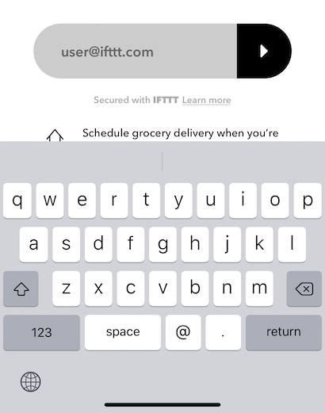

## IFTTT SDK

IFTTT SDK is a iOS library in Swift that allows your users to activate programmable Connections directly in your app. You can find the documentation of the API [here](https://platform.ifttt.com/docs/embedding_applets).

<!-- TOC depthFrom:2 depthTo:6 withLinks:1 updateOnSave:1 orderedList:0 -->

- [Features](#features)
- [Requirements](#requirements)
- [Installation](#installation)
- [Setup](#setup)
- [The Connect Button](#the-connect-button)
- [Authentication](#authentication)
- [Location](#location)
- [Advanced](#advanced)


<!-- /TOC -->

## Features

- [x] Easily authenticate your services to IFTTT through the Connect Button
- [x] Configure the Connect Button through code or through interface builder with `IBDesignable`
- [x] Configure the ConnectButtonController to handle the Connection activation flow
- [x] (Version 2.5.0 and up) Provides native geo-fencing functionality (through [Apple CoreLocation Region Monitoring](https://developer.apple.com/documentation/corelocation/monitoring_the_user_s_proximity_to_geographic_regions)) for connections using [IFTTT Location service](https://ifttt.com/location).

## Requirements

* iOS 10.0+
* Xcode 11+
* Swift 4.0

## Installation

### CocoaPods

[CocoaPods](https://cocoapods.org) is a dependency manager for Cocoa projects. For usage and installation instructions, visit their website. To integrate the Connect SDK into your Xcode project using CocoaPods, specify it in your `Podfile`:

```ruby
pod 'IFTTTConnectSDK'
```

### Carthage

[Carthage](https://github.com/Carthage/Carthage) is a decentralized dependency manager that builds your dependencies and provides you with binary frameworks. To integrate the Connect SDK into your Xcode project using Carthage, specify it in your `Cartfile`:

```ogdl
github "IFTTT/ConnectSDK-iOS"
```

### Manually

#### Embedded Framework

- Download the project's folder, and drag the `IFTTT SDK.xcodeproj` into the Project Navigator of your application’s Xcode project.

    > It should appear nested underneath your application’s blue project icon. Whether it is above or below all the other Xcode groups does not matter.

- Select the `IFTTT SDK.xcodeproj` in the Project Navigator and verify the deployment target matches that of your application target.
- Next, select your application project in the Project Navigator (blue project icon) to navigate to the target configuration window and select the application target under the “Targets” heading in the sidebar.
- In the tab bar at the top of that window, open the “General” panel.
- Click on the `+` button under the “Embedded Binaries” section.    
- Select the top `IFTTT SDK.framework` for iOS.
- And that’s it!

The `IFTTT SDK.framework` is automatically added as a target dependency, linked framework and embedded framework in a “Copy Files” build phase which is all you need to build on the simulator and a device.

## Setup 
### Configure redirect
During Connection activation, your app will receive redirects intended for the Connect Button SDK. You must configure your app's PLIST file to accept incoming redirects with the same approved URI(s) you provide [here](https://platform.ifttt.com/mkt/embedded_redirects).
```
<key>CFBundleURLTypes</key>
<array>
	<dict>
		<key>CFBundleTypeRole</key>
		<string>Viewer</string>
		<key>CFBundleURLName</key>
		<string>com.ifttt.sdk.example</string>
		<key>CFBundleURLSchemes</key>
		<array>
			<string>groceryexpress</string>
		</array>
	</dict>
</array>
```

### Supporting returning user flows
When the user making the connection is already a user on IFTTT, the activation flow may redirect outside of your app to verify the user's account. 
- If the IFTTT app is installed, the Connect Button SDK opens it to process a Connection activation flow. 
- If the IFTTT app is not installed, the user will receive a confirmation link in their email. In order to create a good user experience, we provide a link to user's email client. 
You must configure  `LSApplicationQueriesSchemes` in your app's PLIST file to support returning IFTTT users.
```
<key>LSApplicationQueriesSchemes</key>
<array>
    <string>ifttt-handoff-v1</string>
    <string>message</string>
    <string>googlegmail</string>
    <string>ms-outlook</string>
    <string>ymail</string>
    <string>airmail</string>
    <string>readdle-spark</string>
</array>
```

### Forward redirects to the Connect Button SDK
Use the `ConnectionRedirectHandler` to process these redirects.

**Note:** the `redirectURL` provide must be the same url provided in `ConnectionConfiguration` and used by `ConnectButtonController`.

```
func application(_ app: UIApplication, 
                  open url: URL, 
                  options: [UIApplication.OpenURLOptionsKey : Any] = [:]) -> Bool {
	if connectionRedirectHandler.handleApplicationRedirect(url: url, options: options) {
	    // This is an IFTTT SDK redirect, it will take over from here
	    return true
	} else {
	    // This is unrelated to the IFTTT SDK
	    return false
	}
}
```

### ConnectionCredentialProvider
* There are various codes and tokens you will need to provide the IFTTT SDK when authenticating your services to IFTTT
* Conform an object to `ConnectionCredentialProvider` to handle these requirements.

* `oauthCode`: The OAuth code for your user on your service. This is used to skip a step for connecting to your own service during the Connect Button activation flow. We require this value to provide the best possible user experience. 

* `userToken`: This is the IFTTT user token for your service. This token allows you to get IFTTT user data related to only your service. For example, include this token to get the enabled status of Connections for your user. It is also the same token that is used to make trigger, query, and action requests for Connections on behalf of the user. 

**How to get a `userToken`**

1) See [Authentication](#authentication) for more information on exchanging a user-specific token to make user-authenticated requests.

2) Note that `ConnectButtonControllerDelegate` returns the user token when a connection is activated. You should support both methods to receive the `userToken` since the user may have already connected your service to IFTTT.

* `inviteCode`: This value is only required if your service is not published. You can find it [here](http://platform.ifttt.com/mkt/general#partners_service_invite_url) in the IFTTT Platform. If your service is published, return nil.

```
struct Credentials: ConnectionCredentialProvider {  
  /*
    Provides the partner's OAuth code for a service 
    during authentication with a `Connection`.
  */
  var oauthCode: String { 
    return theOAuthCodeForYourService
  }
  
  /* 
    Provides the service's token associated with IFTTT.
  */
  var userToken: String? { 
    return yourAppsKeychain["key_for_ifttt_token"]
  }
  
  /* 
    Provides the invite code for testing an unpublished 
    `Connection`'s services with the IFTTT platform.
  */
  var inviteCode: String? { 
    return """
    Invite code from platform.ifttt.com or nil if your service is published
    """
  }
}
```

## The Connect Button

The Connect Button provides a consistent and simple way for your users to activate your programmable Connections.

### Initialization
* Add a `ConnectButton` to your view controller
* `ConnectButton` supports `@IBDesignable` allowing you to add it directly in a Storyboard.
* Alternatively you can create it manually `let connectButton = ConnectButton()`

### Layout and customization
The Connect Button is designed to fit into your UI just like any `UIKit` control. There are a few things you should know when creating the layout. 

1) The `ConnectButton` is designed to be placed on a light background.
*Light style*
 

2) The `ConnectButton` has a fixed height of 70 and a maximum width of 329
- The actual height of the `ConnectButton` with footer text will be slightly larger than this to accommodate the space for the text. You should allow the `ConnectButton` to calculate its height rather than setting any layout constraints on this as this will result in an invalid layout. 
- Horizontally, the `ConnectButton` is flexible. If you place it in a wider container than its maximum width, it centers itself in that container. 

3) The `ConnectButton` will prompt users to enter their email the first time that they activate a Connection. You must accommodate for the keyboard presentation in your UI.

 

### Configuring the `ConnectButtonController` 
Once you have the `ConnectButton` in your UI, you'll need to attach it to a `ConnectButtonController`. The controller handles the Connection activation flow. 

First, you'll need to setup a `ConnectionConfiguration`.
Second, you'll need to configure a `ConnectButtonControllerDelegate`.

#### ConnectionConfiguration
This configuration type provides information about the `Connection` that you wish to use with the button and information about the user.
1) `connectionId`: The identifier for the `Connection`. You can find identifier for your programmatic Connections on platform.ifttt.com.
2) `suggestedUserEmail`: The email address that your user uses for your service. This allows us to prefill the email. 
3) `credentialProvider`: The `ConnectionCredentialProvider` you set up in [Setup](#setup)
4) `redirectURL`: The redirect URL you configured in [Setup](#setup)
5) `skipConnectionConfiguration`: A boolean value that allows for the connection configuration to be skipped. See [Configuration skipping](https://github.com/IFTTT/ConnectSDK-iOS#configuration-skipping) for more information.

#### ConnectButtonControllerDelegate
`ConnectButtonControllerDelegate` communicates important information back to your app.

On iOS 13 and up, we need access to a `UIWindow` to show OAuth flows if the user doesn't have the IFTTT app installed. 
This is done by implenting the method:
```
func webAuthenticationPresentationAnchor() -> UIWindow {
  return theWindowToShowTheOAuthFlowOn
}
```

On iOS 12 and lower, we need access to the current view controller periodically to open instances of Safari for OAuth flows.
In this method, simply return the view controller containing the `ConnectButton`.
```
func presentingViewController(for connectButtonController: ConnectButtonController) -> UIViewController {
	return theViewControllerContainingTheConnectButton
}
```

When a `Connection` activation finishes, the controller calls this delegate method to inform your app. On success, this method passes back the updated `Connection` and the IFTTT user token. It is important that you save the this token at this point. You'll need to pass it with `ConnectionCredentialProvider`, the next time the user visits a Connection page in your app. 

```
func connectButtonController(_ connectButtonController: ConnectButtonController, 
                             didFinishActivationWithResult result: Result<ConnectionActivation, ConnectButtonControllerError>) {
  switch result {
  case .success(let activation):
    // A Connection was activated and we received the user IFTTT token
    // Let's update our credential for this user
    if let token = activation.userToken {
        ourConnectionCredentials.loginUser(with: token)
    }
      
  case .failure(let error):
    break 
  }
}
```

Finally there is a callback when a Connection is disabled. You may want to adjust your UI. 

```
func connectButtonController(_ connectButtonController: ConnectButtonController,
                             didFinishDeactivationWithResult result: Result<Connection, ConnectButtonControllerError>) {
  switch result {
  case .success(let updatedConnection):
    // The user disabled this Connection
        
  case .failure(let error):
    // Something went wrong while disabling the Connection 
  }
}
```

**NOTE** These delegate methods return a `Result` that is defined in the Connect Button SDK. We will be migrating to the `Result` that is now part of the Swift standard library in a future update. In the meantime, you can have both in your project without conflict.


#### Create the controller

Once you've setup the `ConnectionConfiguration` and the delegate, you can instantiate the controller. 

```
public init(connectButton: ConnectButton,
            connectionConfiguration: ConnectionConfiguration,
            delegate: ConnectButtonControllerDelegate)
```

That's it! You're ready to start activating programmable Connections directly in your app. 


## Authentication
 To enable the SDK to retrieve connection status for a specific user, as well as allowing the SDK to facilitate disabling a connection, it needs to be user-authenticated, which requires an IFTTT user token. This token is identical to the token returned by your service when a user authenticates via the [service authentication flow](https://platform.ifttt.com/docs/api_reference#authentication-flow).

  A user-authenticated request is one that includes an `Authorization` header containing a user-specific token that IFTTT has issued to your service. This approach lets you make calls to the API from places like mobile apps or browsers where it would be inappropriate to expose your service key.

  ### Exchange a user token
  **URL**: `POST https://connect.ifttt.com/v2/user_token`

  This endpoint can be used to obtain a token for a specific user, allowing you to make user-authenticated requests. 

  ### Example: Get a user token, Service-authenticated with user ID and OAuth token
  ##### HTTP Request
  ```
  POST /v2/user_token?user_id=123&access_token=abc
  Host: connect.ifttt.com
  IFTTT-Service-Key: 6e7c8978c07a3b5918a237b9b5b1bb70
  Content-Type: application/json
  ```
  
  ##### HTTP Response
  ```
  {
    "type": "user_token",
    "user_token": "e1hMBWw44mJM902c6ye9mmuS3nd4A_8eTCU99D4a5KQW7cT1"
  }
  ```

  To clarify the variables used in this example:

  |Variable|Value|Details|
 |--------|-----|-------|
 | `user_id` | `123` | The id of the user on your service, which must match the id provided by your [User information] endpoint |
 | `access_token` | `abc` | The OAuth access token that you issued to IFTTT on behalf of the user when they connected their IFTTT account to your service |
 | `IFTTT-Service-Key` | `6e7...` |  Your secret service key |
 | `user_token` | `e1h...` | The new user token you'll use to make requests to the IFTTT API on behalf of the IFTTT user |

  Within these parameters,
 * You can find the `IFTTT-Service-Key` in the [API tab](https://platform.ifttt.com/mkt/api) of the IFTTT Platform under the Service Key heading. You can use this approach when you’re making calls from your backend servers to the API.
 * `access_token` is **the OAuth access token that you issued to IFTTT on behalf of this user** when they connected their IFTTT account to your service. This lets us verify the request more stringently than if you just provided your service key, without making the user go through a redundant OAuth flow.

  ### Important note about exchanging the user token
 Your IFTTT service key should be kept secret at all time. The service key can be used to make calls on behalf of any user, but a user token is limited to a single user. This makes user tokens much less sensitive. On the other hand, you’d never want to embed your service key into a mobile app because it could be read by end users.

  Because of this, **we strongly encourage you to** call this API on your backend, and return the user token back to your application, instead of making the API call directly within your application.

## Location
### Usage
#### Prerequisite
To use this library, you should have a connection on your service on IFTTT that connects the IFTTT Location service. To learn more about creating connections, please visit [developer documentation](https://platform.ifttt.com/docs/connections).

#### Initialization
To initialize location monitoring, create an instance of `ConnectionsSynchronizer` in `application:willFinishLaunchingWithOptions:` and store it as a property on the app delegate implementation. If you're using SwiftUI, ensure that an instance of this object is created before the app finishes launches. This is to make sure the SDK can set up connection monitoring and geofence registration as early as possible.

## Advanced

### Fetching a Connection
You may use `ConnectionNetworkController` directly to fetch a `Connection` from the Connection API. This is not a neccessary step. You could simply allow `ConnectButtonController` to do this. 

* Use `ConnectionNetworkController` to fetch your service’s `Connection`.
* `Connection.Request` handles creating the necessary `URLRequest`s.

```
connectionNetworkController.start(request: .fetchConnection(for: id, credentialProvider: yourCredentialProvider)) { response
	switch response.result {
	case .success(let connection):
		let config = ConnectionConfiguration(connection: connection, 
                                         suggestedUserEmail: yourUsersEmail,
                                         credentialProvider: yourCredentialProvider,
                                         connectAuthorizationRedirectURL: theRedirectURLForYourIFTTTService)
				     
    let controller = ConnectButtonController(connectButton: self.connectButton,
                                             connectionConfiguration: config,
                                             delegate: self)
    
		self.connectButtonController = controller
	case .failure(let error):
		break
	}
}
```

Once you have a `Connection`, you can use an alternative initializer for `ConnectionConfiguration` that takes a `Connection`. Doing this will skip the loading state. 

### Tracking
In order to continually innovate and improve our SDK, IFTTT may collect certain usage statistics from the software including but not limited to an anonymized unique identifier, version number of the software, and user interactions with elements of the UI provided by the SDK. It is common practice, and your responsibility as a user of the IFTTT SDK, to inform your customers that they may opt-out of information collection. The instructions in this section explain how you can enable opt-out. When properly implemented by you, if consent is withheld, the information will not be collected.

The data collected is examined in the aggregate to improve the SDK and IFTTT’s associated services, and is maintained in accordance with IFTTT's [Privacy Policy](https://ifttt.com/terms).

#### Anonymous ID
By default, the SDK will track user interactions when users interact with the ConnectButton. In order to distinguish unique installs, we randomly generate a UUID per application installation (“anonymous id”), and send it along with the event requests.

#### Disable tracking
You may set `ConnectButtonController.analyticsEnabled = false` if you wish to opt-out from tracking. After this method is called, all tracking will be disabled for all of the ConnectButton instances within the app for as long as it is in-memory. If you want to persist the user's preference for disabling tracking, you should store the preference within your persistent storage, and set this variable every time the app is started.

### Localization
The Connect Button and the corresponding flow can display translated text that is different from the user's current locale. To pass in a different locale, pass in a Swift `Locale` object for the `locale` parameter of the `ConnectButtonController` initializer. For example, if the Connect Button is to be displayed in Latin American Spanish:
```
let locale = Locale(identifier: "es-419")
let config = ConnectionConfiguration(connection: connection, 
                                      suggestedUserEmail: yourUsersEmail,
                                      credentialProvider: yourCredentialProvider,
                                      connectAuthorizationRedirectURL: theRedirectURLForYourIFTTTService)
let controller = ConnectButtonController(connectButton: self.connectButton,
                                         connectionConfiguration: config,
                                         locale: locale,
                                         delegate: self)
```
If no translations are found for a locale passed in for this parameter, the Connect Button and the corresponding flow will be displayed in English. If no value is provided for the `locale` parameter, a default value of `Locale.current` will be used.

Text translation is supported for the following languages:
* English - United States (en-US)
* English - United Kingdom (en-GB)
* Czech (cs)
* Danish (da)
* German (de)
* Spanish (es)
* Spanish - Latin America and Caribbean region (es-419)
* Finnish (fi)
* French (fr)
* French - Canada (fr-CA)
* Italian (it)
* Japanese (ja)
* Korean (ko)
* Norwegian-Bokmål (nb)
* Dutch (nl)
* Polish (pl)
* Portuguese - Brazil (pt-BR)
* Portuguese - Portugal (pt-PT)
* Russian (ru)
* Swedish (sv)
* Simplified Chinese (zh-Hans)
* Traditional Chinese (zh-Hant)

### Configuration skipping
You can use the `skipConnectionConfiguration` parameter on the `ConnectionConfiguration` initializer if you want to use your own connection configuration UI. Setting this parameter to `true` will instruct IFTTT to skip the connection configuration screen. This parameter defaults to `false`. Once a user clicks the connect button they will be taken through the usual connection flow however they will not see the connection configuration screen but will be redirected back to your app instead. After that you will be able to use the [field options endpoint](https://platform.ifttt.com/docs/connect_api#field-options) and the [update a connection endpoint](https://platform.ifttt.com/docs/connect_api#update-a-connection) to support your UI and allow the user to configure the connection. A user connection created with `skipConnectionConfiguration=true` is considered pending 
and will not fire it's triggers or allow you to run it's actions or queries until it's updated using the [update a connection endpoint](https://platform.ifttt.com/docs/connect_api#update-a-connection).
